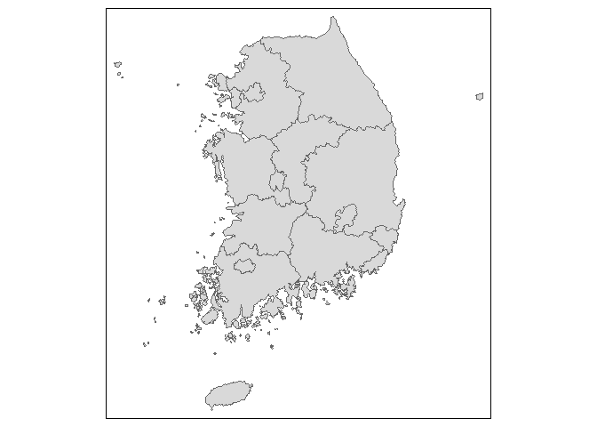
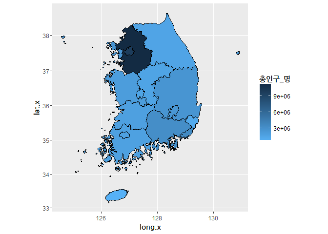
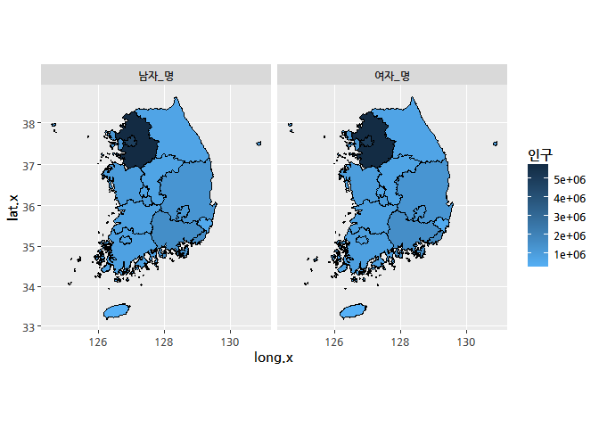

Untitled
================

한국 지도 시각화
----------------

``` r
# Kormaps를 이용해 세부적인 한국 지도 그리기
# 패키지 세팅하기
if (!require("Kormaps")){devtools::install_github("cardiomoon/Kormaps")}
```

    ## Loading required package: Kormaps

``` r
if (!require("tmap")){install.packages("tmap")}
```

    ## Loading required package: tmap

    ## Warning: package 'tmap' was built under R version 3.4.1

``` r
if (!require("cartogram")){devtools::install_github("sjewo/cartogram")}
```

    ## Loading required package: cartogram

``` r
if (!require("mapproj")){install.packages("mapproj")}
```

    ## Loading required package: mapproj

    ## Warning: package 'mapproj' was built under R version 3.4.1

    ## Loading required package: maps

    ## Warning: package 'maps' was built under R version 3.4.1

``` r
library(Kormaps)
library(tmap)
library(cartogram)
```

``` r
# 윈도우를 위한 폰트 설정하기
# for windows
windowsFonts()
```

    ## $serif
    ## [1] "TT Times New Roman"
    ## 
    ## $sans
    ## [1] "TT Arial"
    ## 
    ## $mono
    ## [1] "TT Courier New"

``` r
if (!require("extrafont")){install.packages("extrafont")}
```

    ## Loading required package: extrafont

    ## Registering fonts with R

``` r
library(extrafont)
#font_import()
head(loadfonts())
```

    ## Agency FB already registered with pdfFonts().

    ## Algerian already registered with pdfFonts().

    ## Ami R already registered with pdfFonts().

    ## Arial Black already registered with pdfFonts().

    ## Arial already registered with pdfFonts().

    ## Arial Narrow already registered with pdfFonts().

    ## Arial Rounded MT Bold already registered with pdfFonts().

    ## Baskerville Old Face already registered with pdfFonts().

    ## Bauhaus 93 already registered with pdfFonts().

    ## Bell MT already registered with pdfFonts().

    ## Berlin Sans FB already registered with pdfFonts().

    ## No regular (non-bold, non-italic) version of Berlin Sans FB Demi. Skipping setup for this font.

    ## Bernard MT Condensed already registered with pdfFonts().

    ## Blackadder ITC already registered with pdfFonts().

    ## Bodoni MT already registered with pdfFonts().

    ## Bodoni MT Black already registered with pdfFonts().

    ## Bodoni MT Condensed already registered with pdfFonts().

    ## Bodoni MT Poster Compressed already registered with pdfFonts().

    ## Book Antiqua already registered with pdfFonts().

    ## Bookman Old Style already registered with pdfFonts().

    ## Bookshelf Symbol 7 already registered with pdfFonts().

    ## Bradley Hand ITC already registered with pdfFonts().

    ## Britannic Bold already registered with pdfFonts().

    ## Broadway already registered with pdfFonts().

    ## No regular (non-bold, non-italic) version of Brush Script MT. Skipping setup for this font.

    ## Calibri already registered with pdfFonts().

    ## Calibri Light already registered with pdfFonts().

    ## Californian FB already registered with pdfFonts().

    ## Calisto MT already registered with pdfFonts().

    ## No regular (non-bold, non-italic) version of Cambria. Skipping setup for this font.

    ## Candara already registered with pdfFonts().

    ## Castellar already registered with pdfFonts().

    ## Centaur already registered with pdfFonts().

    ## Century already registered with pdfFonts().

    ## Century Gothic already registered with pdfFonts().

    ## Century Schoolbook already registered with pdfFonts().

    ## Chiller already registered with pdfFonts().

    ## Colonna MT already registered with pdfFonts().

    ## Comic Sans MS already registered with pdfFonts().

    ## Consolas already registered with pdfFonts().

    ## Constantia already registered with pdfFonts().

    ## Cooper Black already registered with pdfFonts().

    ## Copperplate Gothic Bold already registered with pdfFonts().

    ## Copperplate Gothic Light already registered with pdfFonts().

    ## Corbel already registered with pdfFonts().

    ## Courier New already registered with pdfFonts().

    ## Curlz MT already registered with pdfFonts().

    ## Dubai already registered with pdfFonts().

    ## Dubai Light already registered with pdfFonts().

    ## Dubai Medium already registered with pdfFonts().

    ## Ebrima already registered with pdfFonts().

    ## Edwardian Script ITC already registered with pdfFonts().

    ## Elephant already registered with pdfFonts().

    ## Engravers MT already registered with pdfFonts().

    ## Eras Bold ITC already registered with pdfFonts().

    ## Eras Demi ITC already registered with pdfFonts().

    ## Eras Light ITC already registered with pdfFonts().

    ## Eras Medium ITC already registered with pdfFonts().

    ## Felix Titling already registered with pdfFonts().

    ## Footlight MT Light already registered with pdfFonts().

    ## Forte already registered with pdfFonts().

    ## Franklin Gothic Book already registered with pdfFonts().

    ## Franklin Gothic Demi already registered with pdfFonts().

    ## Franklin Gothic Demi Cond already registered with pdfFonts().

    ## Franklin Gothic Heavy already registered with pdfFonts().

    ## Franklin Gothic Medium already registered with pdfFonts().

    ## Franklin Gothic Medium Cond already registered with pdfFonts().

    ## Freestyle Script already registered with pdfFonts().

    ## French Script MT already registered with pdfFonts().

    ## Gabriola already registered with pdfFonts().

    ## Gadugi already registered with pdfFonts().

    ## Garamond already registered with pdfFonts().

    ## Georgia already registered with pdfFonts().

    ## Gigi already registered with pdfFonts().

    ## Gill Sans Ultra Bold already registered with pdfFonts().

    ## Gill Sans Ultra Bold Condensed already registered with pdfFonts().

    ## Gill Sans MT already registered with pdfFonts().

    ## Gill Sans MT Condensed already registered with pdfFonts().

    ## Gill Sans MT Ext Condensed Bold already registered with pdfFonts().

    ## Gloucester MT Extra Condensed already registered with pdfFonts().

    ## Goudy Old Style already registered with pdfFonts().

    ## Goudy Stout already registered with pdfFonts().

    ## HYGraphic-Medium already registered with pdfFonts().

    ## HYGungSo-Bold already registered with pdfFonts().

    ## HYGothic-Extra already registered with pdfFonts().

    ## HYGothic-Medium already registered with pdfFonts().

    ## HYHeadLine-Medium already registered with pdfFonts().

    ## HYMyeongJo-Extra already registered with pdfFonts().

    ## HYSinMyeongJo-Medium already registered with pdfFonts().

    ## HYPMokGak-Bold already registered with pdfFonts().

    ## HYPost-Light already registered with pdfFonts().

    ## HYPost-Medium already registered with pdfFonts().

    ## HYShortSamul-Medium already registered with pdfFonts().

    ## Haettenschweiler already registered with pdfFonts().

    ## No regular (non-bold, non-italic) version of Harlow Solid Italic. Skipping setup for this font.

    ## Harrington already registered with pdfFonts().

    ## HCR Batang already registered with pdfFonts().

    ## HCR Batang ExtB already registered with pdfFonts().

    ## HCR Dotum already registered with pdfFonts().

    ## Headline R already registered with pdfFonts().

    ## High Tower Text already registered with pdfFonts().

    ## HoloLens MDL2 Assets already registered with pdfFonts().

    ## HyhwpEQ already registered with pdfFonts().

    ## Impact already registered with pdfFonts().

    ## Imprint MT Shadow already registered with pdfFonts().

    ## Informal Roman already registered with pdfFonts().

    ## Javanese Text already registered with pdfFonts().

    ## Jokerman already registered with pdfFonts().

    ## Juice ITC already registered with pdfFonts().

    ## NewJumja already registered with pdfFonts().

    ## Kristen ITC already registered with pdfFonts().

    ## Kunstler Script already registered with pdfFonts().

    ## Wide Latin already registered with pdfFonts().

    ## Leelawadee already registered with pdfFonts().

    ## Leelawadee UI already registered with pdfFonts().

    ## Leelawadee UI Semilight already registered with pdfFonts().

    ## More than one version of regular/bold/italic found for Lucida Bright. Skipping setup for this font.

    ## No regular (non-bold, non-italic) version of Lucida Calligraphy. Skipping setup for this font.

    ## Lucida Console already registered with pdfFonts().

    ## More than one version of regular/bold/italic found for Lucida Fax. Skipping setup for this font.

    ## No regular (non-bold, non-italic) version of Lucida Handwriting. Skipping setup for this font.

    ## More than one version of regular/bold/italic found for Lucida Sans. Skipping setup for this font.

    ## Lucida Sans Typewriter already registered with pdfFonts().

    ## Lucida Sans Unicode already registered with pdfFonts().

    ## Magic R already registered with pdfFonts().

    ## No regular (non-bold, non-italic) version of Magneto. Skipping setup for this font.

    ## Maiandra GD already registered with pdfFonts().

    ## Malgun Gothic already registered with pdfFonts().

    ## Malgun Gothic Semilight already registered with pdfFonts().

    ## Marlett already registered with pdfFonts().

    ## Matura MT Script Capitals already registered with pdfFonts().

    ## MBatang already registered with pdfFonts().

    ## MDotum already registered with pdfFonts().

    ## MGungHeulim already registered with pdfFonts().

    ## MGungJeong already registered with pdfFonts().

    ## MHunmin already registered with pdfFonts().

    ## Microsoft Himalaya already registered with pdfFonts().

    ## Microsoft Yi Baiti already registered with pdfFonts().

    ## Microsoft New Tai Lue already registered with pdfFonts().

    ## Microsoft PhagsPa already registered with pdfFonts().

    ## Microsoft Sans Serif already registered with pdfFonts().

    ## Microsoft Tai Le already registered with pdfFonts().

    ## Microsoft Uighur already registered with pdfFonts().

    ## Mistral already registered with pdfFonts().

    ## MJemokBatang already registered with pdfFonts().

    ## MJemokGothic already registered with pdfFonts().

    ## Modern No. 20 already registered with pdfFonts().

    ## Mongolian Baiti already registered with pdfFonts().

    ## Monotype Corsiva already registered with pdfFonts().

    ## MS Outlook already registered with pdfFonts().

    ## MS Reference Sans Serif already registered with pdfFonts().

    ## MS Reference Specialty already registered with pdfFonts().

    ## MSugiHeulim already registered with pdfFonts().

    ## MSugiJeong already registered with pdfFonts().

    ## MT Extra already registered with pdfFonts().

    ## MV Boli already registered with pdfFonts().

    ## Myanmar Text already registered with pdfFonts().

    ## NanumBarunGothic already registered with pdfFonts().

    ## NanumBarunGothic Light already registered with pdfFonts().

    ## NanumBarunGothic UltraLight already registered with pdfFonts().

    ## NanumBarunpen already registered with pdfFonts().

    ## No regular (non-bold, non-italic) version of NanumBarunpen Bold. Skipping setup for this font.

    ## Nanum Brush Script already registered with pdfFonts().

    ## NanumGothic already registered with pdfFonts().

    ## NanumGothicExtraBold already registered with pdfFonts().

    ## NanumGothic Light already registered with pdfFonts().

    ## NanumMyeongjo already registered with pdfFonts().

    ## NanumMyeongjoExtraBold already registered with pdfFonts().

    ## Nanum Pen Script already registered with pdfFonts().

    ## NanumSquare Bold already registered with pdfFonts().

    ## NanumSquare ExtraBold already registered with pdfFonts().

    ## NanumSquare Light already registered with pdfFonts().

    ## NanumSquare already registered with pdfFonts().

    ## New Gulim already registered with pdfFonts().

    ## Niagara Engraved already registered with pdfFonts().

    ## Niagara Solid already registered with pdfFonts().

    ## Nirmala UI already registered with pdfFonts().

    ## Nirmala UI Semilight already registered with pdfFonts().

    ## OCR-Bold already registered with pdfFonts().

    ## OCR A Extended already registered with pdfFonts().

    ## Old English Text MT already registered with pdfFonts().

    ## Onyx already registered with pdfFonts().

    ## Opificio already registered with pdfFonts().

    ## Palace Script MT already registered with pdfFonts().

    ## Palatino Linotype already registered with pdfFonts().

    ## Papyrus already registered with pdfFonts().

    ## Parchment already registered with pdfFonts().

    ## Perpetua already registered with pdfFonts().

    ## Perpetua Titling MT already registered with pdfFonts().

    ## Playbill already registered with pdfFonts().

    ## Poor Richard already registered with pdfFonts().

    ## Pristina already registered with pdfFonts().

    ## Pyunji R already registered with pdfFonts().

    ## No regular (non-bold, non-italic) version of Rage Italic. Skipping setup for this font.

    ## Ravie already registered with pdfFonts().

    ## Rockwell already registered with pdfFonts().

    ## Rockwell Condensed already registered with pdfFonts().

    ## Rockwell Extra Bold already registered with pdfFonts().

    ## Script MT Bold already registered with pdfFonts().

    ## Segoe MDL2 Assets already registered with pdfFonts().

    ## Segoe Print already registered with pdfFonts().

    ## Segoe Script already registered with pdfFonts().

    ## Segoe UI already registered with pdfFonts().

    ## Segoe UI Light already registered with pdfFonts().

    ## Segoe UI Semibold already registered with pdfFonts().

    ## Segoe UI Semilight already registered with pdfFonts().

    ## Segoe UI Black already registered with pdfFonts().

    ## Segoe UI Emoji already registered with pdfFonts().

    ## Segoe UI Historic already registered with pdfFonts().

    ## Segoe UI Symbol already registered with pdfFonts().

    ## Showcard Gothic already registered with pdfFonts().

    ## SimSun-ExtB already registered with pdfFonts().

    ## Snap ITC already registered with pdfFonts().

    ## Stencil already registered with pdfFonts().

    ## Sylfaen already registered with pdfFonts().

    ## Symbol already registered with pdfFonts().

    ## Tahoma already registered with pdfFonts().

    ## Tempus Sans ITC already registered with pdfFonts().

    ## Times New Roman already registered with pdfFonts().

    ## Trebuchet MS already registered with pdfFonts().

    ## Tw Cen MT already registered with pdfFonts().

    ## Tw Cen MT Condensed already registered with pdfFonts().

    ## Tw Cen MT Condensed Extra Bold already registered with pdfFonts().

    ## Verdana already registered with pdfFonts().

    ## Viner Hand ITC already registered with pdfFonts().

    ## No regular (non-bold, non-italic) version of Vivaldi. Skipping setup for this font.

    ## Vladimir Script already registered with pdfFonts().

    ## Webdings already registered with pdfFonts().

    ## Wingdings already registered with pdfFonts().

    ## Wingdings 2 already registered with pdfFonts().

    ## Wingdings 3 already registered with pdfFonts().

    ## Yet R already registered with pdfFonts().

    ## NULL

``` r
# 내장 인구 데이터를 이용해 한국 지도 그리기
qtm(kormap1)
```



``` r
#qtm(korpopmap1,"총인구_명")
#qtm(korpopmap2,"총인구_명")
```

``` r
# 인코딩 문제 고치기
Encoding(names(korpopmap1))<-"UTF-8"
Encoding(korpopmap1@data$name)<-"UTF-8"
Encoding(korpopmap1@data$`행정구역별_읍면동`)<-"UTF-8"

head(korpopmap1@data)
```

    ##    SP_ID FID code code1     long      lat order  hole piece group id
    ## 15    15  15   11    11 201656.3 466516.9     1 FALSE     1  15.1 15
    ## 14    14  14   21    21 400871.5 211233.1     1 FALSE     1  14.1 14
    ## 13    13  13   22    22 352753.8 280873.7     1 FALSE     1  13.1 13
    ## 12    12  12   23    23 173977.4 456201.3     1 FALSE     1  12.1 12
    ## 11    11  11   24    24 191583.7 195513.6     1 FALSE     1  11.1 11
    ## 10    10  10   25    25 244601.6 313296.7     1 FALSE     1  10.1 10
    ##    FID.data code.data code.1       name name_eng base_year
    ## 15       15        11     11 서울특별시    Seoul      2010
    ## 14       14        21     21 부산광역시    Busan      2010
    ## 13       13        22     22 대구광역시    Daegu      2010
    ## 12       12        23     23 인천광역시  Incheon      2010
    ## 11       11        24     24 광주광역시  Gwangju      2010
    ## 10       10        25     25 대전광역시  Daejeon      2010
    ##    C행정구역별_읍면동 행정구역별_읍면동 시점 총인구_명 남자_명 여자_명
    ## 15                 11        서울특별시 2010   9794304 4803373 4990931
    ## 14                 21        부산광역시 2010   3414950 1676689 1738261
    ## 13                 22        대구광역시 2010   2446418 1212584 1233834
    ## 12                 23        인천광역시 2010   2662509 1334576 1327933
    ## 11                 24        광주광역시 2010   1475745  729330  746415
    ## 10                 25        대전광역시 2010   1501859  750762  751097
    ##    내국인_계_명 내국인_남자_명 내국인_여자_명 외국인_계_명 외국인_남자_명
    ## 15      9631482        4726028        4905454       162822          77345
    ## 14      3393191        1664678        1728513        21759          12011
    ## 13      2431774        1204428        1227346        14644           8156
    ## 12      2632035        1315562        1316473        30474          19014
    ## 11      1466143         724161         741982         9602           5169
    ## 10      1490158         745150         745008        11701           5612
    ##    외국인_여자_명 가구_계_가구 일반가구_가구 집단가구_가구 외국인가구_가구
    ## 15          85477      3577497       3504297          2836           70364
    ## 14           9748      1251756       1243880           785            7091
    ## 13           6488       873934        868327           553            5054
    ## 12          11460       929489        918850           972            9667
    ## 11           4433       518742        515855           646            2241
    ## 10           6089       536297        532643           478            3176
    ##    주택_계_호 단독주택_호 아파트_호 연립주택_호 다세대주택_호
    ## 15    2525210      405575   1485869      145914        463417
    ## 14    1031331      244570    640944       36013         97308
    ## 13     691702      166307    464960        5084         47099
    ## 12     822552      108315    483847       24923        197957
    ## 11     443925       93147    339732        4196          2997
    ## 10     421620       81701    296250       10975         28589
    ##    비거주용_건물내_주택_호 주택이외의_거처_호 region code1.data
    ## 15                   24435              97389     11         11
    ## 14                   12496              22763     21         21
    ## 13                    8252               2555     22         22
    ## 12                    7510              21076     23         23
    ## 11                    3853               3589     24         24
    ## 10                    4105               5261     25         25

``` r
library(tidyverse)
```

    ## Loading tidyverse: ggplot2
    ## Loading tidyverse: tibble
    ## Loading tidyverse: tidyr
    ## Loading tidyverse: readr
    ## Loading tidyverse: purrr
    ## Loading tidyverse: dplyr

    ## Conflicts with tidy packages ----------------------------------------------

    ## filter(): dplyr, stats
    ## lag():    dplyr, stats
    ## map():    purrr, maps

``` r
# ggplot 으로 한국 지도 그리기 위한 전처리
kor <- fortify(korpopmap1, region = "id")
kordf <- merge(kor, korpopmap1@data, by = "id")
```

``` r
# ggplot으로 한국 지도 그리기
ggplot(kordf, aes(x=long.x, y=lat.x, group=group.x, fill=`총인구_명`)) + 
  geom_polygon(color="black") + coord_map() +
  scale_fill_gradient(high = "#132B43", low = "#56B1F7") +
  theme(title=element_text(family="NanumGothic",face="bold"))
```



``` r
# ggplot facet 기능 적용해 보기
# 남녀 인구로 구분
kordfs <- kordf %>% select(id:`여자_명`) %>%
  gather(`성별`,`인구`,-(id:`총인구_명`))

# 남녀 인구 한국 지도 시각화
ggplot(kordfs, aes(x=long.x, y=lat.x, group=group.x, fill=`인구`)) + 
  geom_polygon(color="black") + coord_map() +
  scale_fill_gradient(high = "#132B43", low = "#56B1F7") +
  theme(text=element_text(family="NanumGothic",face="bold")) +
  facet_grid(.~ `성별`)
```



2016년 총선 결과 cartogram 그리기
---------------------------------

<https://www.facebook.com/groups/krstudy/permalink/785465478294393/>

cartogram의 다른 예시(ggplot 아님)
----------------------------------

<https://github.com/jjangkr/cartogram_4_anything>

``` r
if (!require("rgdal")){install.packages("rgdal")}
```

    ## Loading required package: rgdal

    ## Warning: package 'rgdal' was built under R version 3.4.1

    ## Loading required package: sp

    ## Warning: package 'sp' was built under R version 3.4.1

    ## rgdal: version: 1.2-8, (SVN revision 663)
    ##  Geospatial Data Abstraction Library extensions to R successfully loaded
    ##  Loaded GDAL runtime: GDAL 2.0.1, released 2015/09/15
    ##  Path to GDAL shared files: C:/Users/mrchypark/Documents/R/win-library/3.4/sf/gdal
    ##  Loaded PROJ.4 runtime: Rel. 4.9.2, 08 September 2015, [PJ_VERSION: 492]
    ##  Path to PROJ.4 shared files: C:/Users/mrchypark/Documents/R/win-library/3.4/sf/proj
    ##  Linking to sp version: 1.2-5

``` r
if (!require("maptools")){install.packages("maptools")}
```

    ## Loading required package: maptools

    ## Warning: package 'maptools' was built under R version 3.4.1

    ## Checking rgeos availability: TRUE

``` r
library(rgdal)
library(maptools)
library(ggplot2)
korea <- readOGR(dsn = "./data/election", layer="DistResult2016", encoding = 'euc-kr')
```

    ## OGR data source with driver: ESRI Shapefile 
    ## Source: "./data/election", layer: "DistResult2016"
    ## with 253 features
    ## It has 16 fields

``` r
# sp패키지의 SpatialPolygonsDataFrame 자료형을 사용합니다.
class(korea)
```

    ## [1] "SpatialPolygonsDataFrame"
    ## attr(,"package")
    ## [1] "sp"

``` r
# 카토그램 모양을 계산합니다. 시간이 꽤 걸리니 5이하의 숫자를 사옹해 주세요.
# 지금은 미리 만든 객체를 불러올 것입니다.
# c_korea <- cartogram(korea, "Pop", 5)
# save(c_korea,file = "c_korea.RData")
load("c_korea.RData")
# data.frame으로 변환하기 위해 fortify 함수를 사용합니다.
c_korea.df <- fortify(c_korea)
```

    ## Regions defined for each Polygons

``` r
# 변환된 상태
class(c_korea.df)
```

    ## [1] "data.frame"

``` r
head(c_korea.df)
```

    ##       long     lat order  hole piece id group
    ## 1 982803.5 1984587     1 FALSE     1  0   0.1
    ## 2 982848.9 1984463     2 FALSE     1  0   0.1
    ## 3 982871.2 1984402     3 FALSE     1  0   0.1
    ## 4 982882.7 1984369     4 FALSE     1  0   0.1
    ## 5 982925.3 1984247     5 FALSE     1  0   0.1
    ## 6 982957.2 1984128     6 FALSE     1  0   0.1

``` r
summary(c_korea.df)
```

    ##       long              lat              order          hole        
    ##  Min.   : 755211   Min.   :1480831   Min.   :    1   Mode :logical  
    ##  1st Qu.: 958417   1st Qu.:1685091   1st Qu.: 1340   FALSE:1212246  
    ##  Median :1013273   Median :1784783   Median : 4558   TRUE :55       
    ##  Mean   :1012899   Mean   :1785759   Mean   : 9103                  
    ##  3rd Qu.:1066499   3rd Qu.:1873419   3rd Qu.:11692                  
    ##  Max.   :1371071   Max.   :2031296   Max.   :65701                  
    ##                                                                     
    ##      piece             id                group        
    ##  1      :912946   Length:1212301     230.1  :  25929  
    ##  2      : 55092   Class :character   179.1  :  20450  
    ##  4      : 17540   Mode  :character   218.1  :  20317  
    ##  3      : 15271                      181.1  :  17633  
    ##  6      : 12504                      232.1  :  17579  
    ##  5      : 11734                      210.1  :  17184  
    ##  (Other):187214                      (Other):1093209

``` r
str(c_korea.df)
```

    ## 'data.frame':    1212301 obs. of  7 variables:
    ##  $ long : num  982803 982849 982871 982883 982925 ...
    ##  $ lat  : num  1984587 1984463 1984402 1984369 1984247 ...
    ##  $ order: int  1 2 3 4 5 6 7 8 9 10 ...
    ##  $ hole : logi  FALSE FALSE FALSE FALSE FALSE FALSE ...
    ##  $ piece: Factor w/ 330 levels "1","2","3","4",..: 1 1 1 1 1 1 1 1 1 1 ...
    ##  $ id   : chr  "0" "0" "0" "0" ...
    ##  $ group: Factor w/ 2407 levels "0.1","1.1","2.1",..: 1 1 1 1 1 1 1 1 1 1 ...

``` r
# 데이터를 합치기 위한 키 생성
c_korea@data$id <- rownames(c_korea@data)
# 데이터 합치기 - 조인
c_korea.df <- c_korea.df %>% left_join(c_korea@data, by="id")
str(c_korea.df)
```

    ## 'data.frame':    1212301 obs. of  23 variables:
    ##  $ long   : num  971543 971584 971604 971615 971654 ...
    ##  $ lat    : num  1981063 1980986 1980948 1980927 1980851 ...
    ##  $ order  : int  1 2 3 4 5 6 7 8 9 10 ...
    ##  $ hole   : logi  FALSE FALSE FALSE FALSE FALSE FALSE ...
    ##  $ piece  : Factor w/ 330 levels "1","2","3","4",..: 1 1 1 1 1 1 1 1 1 1 ...
    ##  $ id     : chr  "0" "0" "0" "0" ...
    ##  $ group  : Factor w/ 2407 levels "0.1","1.1","2.1",..: 1 1 1 1 1 1 1 1 1 1 ...
    ##  $ Dist   : Factor w/ 253 levels "\xec꽌\xec슱\xec슜\xec궛援\xac",..: 4 4 4 4 4 4 4 4 4 4 ...
    ##  $ ID     : num  1 1 1 1 1 1 1 1 1 1 ...
    ##  $ Pop    : num  134507 134507 134507 134507 134507 ...
    ##  $ Poll   : num  84893 84893 84893 84893 84893 ...
    ##  $ Sae    : num  33490 33490 33490 33490 33490 ...
    ##  $ The    : num  44342 44342 44342 44342 44342 ...
    ##  $ Peo    : num  4725 4725 4725 4725 4725 ...
    ##  $ Result : num  2 2 2 2 2 2 2 2 2 2 ...
    ##  $ Turnout: num  0.631 0.631 0.631 0.631 0.631 ...
    ##  $ RatioS : num  0.394 0.394 0.394 0.394 0.394 ...
    ##  $ RatioT : num  0.522 0.522 0.522 0.522 0.522 ...
    ##  $ RatioP : num  0.0557 0.0557 0.0557 0.0557 0.0557 ...
    ##  $ SD     : Factor w/ 17 levels "\xec꽌\xec슱",..: 1 1 1 1 1 1 1 1 1 1 ...
    ##  $ SGG    : Factor w/ 241 levels "\xeb떖\xec꽌援ъ쓣",..: 6 6 6 6 6 6 6 6 6 6 ...
    ##  $ X      : num  953890 953890 953890 953890 953890 ...
    ##  $ Y      : num  1955122 1955122 1955122 1955122 1955122 ...

``` r
# 빈 테마 미리 만들기
theme_clean <- function(base_size = 12) {
  require(grid)
  theme_grey(base_size) %+replace%
    theme(
      axis.title = element_blank(),
      axis.text = element_blank(),
      panel.background = element_blank(),
      panel.grid = element_blank(),
      axis.ticks.length = unit(0, "cm"),
      complete = TRUE
    )
}
```

    # 카토그램 그리기 
    election <- ggplot(c_korea.df, aes(x=long, y=lat, group=group)) + 
      geom_polygon(aes(alpha=RatioS), fill=rgb(1,0,0), colour="white", lwd = 0.01) +
      geom_polygon(aes(alpha=RatioP), fill=rgb(0,1,0), colour="white", lwd = 0.01) +
      geom_polygon(aes(alpha=RatioT), fill=rgb(0,0,1), colour="white", lwd = 0.01) +
      guides(fill=FALSE, alpha=FALSE) + theme_void() + coord_map()

    election
